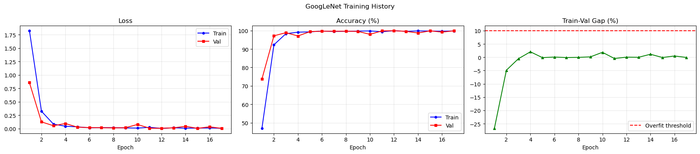

# 🚦 GTSRB Traffic Sign Recognition with GoogLeNet

基于 GoogLeNet (Inception v1) 的德国交通标志识别 (GTSRB) 深度学习项目，在 43 类交通标志上达到 **99.90% 验证准确率**。

---

## 📊 Results

| Metric | Value |
|--------|-------|
| **Best Val Accuracy** | **99.90%** |
| **Final Test Accuracy** | **~99.9%** |
| **Total Parameters** | ~2.5M |
| **Training Epochs** | 17 (Early Stopping) |
| **Device** | Apple M2 Pro (MPS) |

### Training Log

```
===========================================================================
Epoch | TrainLoss | TrainAcc |  ValLoss |  ValAcc |    Gap |         LR |  Time
===========================================================================
    1 |    1.8256 |   46.92% |   0.8569 |  73.68% | -26.8% |   0.001000 |  107s
    2 |    0.3229 |   92.28% |   0.1246 |  97.16% |  -4.9% |   0.001000 |  110s
    3 |    0.0833 |   98.32% |   0.0531 |  98.87% |  -0.5% |   0.001000 |  117s
    4 |    0.0436 |   99.12% |   0.0944 |  97.07% |   2.1% |   0.001000 |  109s
    5 |    0.0319 |   99.30% |   0.0254 |  99.43% |  -0.1% |   0.001000 |  109s
    6 |    0.0145 |   99.74% |   0.0188 |  99.66% |   0.1% |   0.001000 |  114s
    7 |    0.0191 |   99.55% |   0.0159 |  99.66% |  -0.1% |   0.001000 |  130s
    8 |    0.0161 |   99.62% |   0.0135 |  99.66% |  -0.0% |   0.001000 |  130s
    9 |    0.0126 |   99.72% |   0.0160 |  99.57% |   0.2% |   0.001000 |  124s
   10 |    0.0089 |   99.81% |   0.0764 |  97.95% |   1.9% |   0.001000 |  114s
   11 |    0.0235 |   99.37% |   0.0068 |  99.83% |  -0.5% |   0.001000 |  132s
   12 |    0.0032 |   99.94% |   0.0057 |  99.90% |   0.0% |   0.001000 |  121s
   13 |    0.0153 |   99.58% |   0.0137 |  99.59% |  -0.0% |   0.001000 |  120s
   14 |    0.0072 |   99.82% |   0.0416 |  98.69% |   1.1% |   0.001000 |  134s
   15 |    0.0096 |   99.75% |   0.0050 |  99.85% |  -0.1% |   0.001000 |  122s
   16 |    0.0107 |   99.67% |   0.0320 |  99.18% |   0.5% |   0.001000 |  114s
   17 |    0.0071 |   99.79% |   0.0042 |  99.86% |  -0.1% |   0.001000 |  104s

🛑 Early Stopping triggered (no improvement for 5 epochs)
===========================================================================
✅ Best Validation Accuracy: 99.90%
💾 Model saved: ./gtsrb_googlenet_best.pth
```

### Training Curves



---

## 🏗️ Architecture

### GoogLeNet (Simplified for 64x64 Input)

```
Input (3, 64, 64)
    ↓
Initial Conv Block → (64, 32, 32)
    ↓
Inception Block 1  → (128, 32, 32)
    ↓
MaxPool            → (128, 16, 16)
    ↓
Inception Block 2  → (256, 16, 16)
    ↓
MaxPool            → (256, 8, 8)
    ↓
Inception Block 3  → (512, 8, 8)
    ↓
Global Average Pool → (512, 1, 1)
    ↓
Dropout (0.4)
    ↓
FC → 43 classes
```

### Inception Block Design

Each Inception block has 4 parallel branches:
- **Branch 1**: 1x1 conv (dimension reduction)
- **Branch 2**: 1x1 conv → 3x3 conv
- **Branch 3**: 1x1 conv → 5x5 conv
- **Branch 4**: 3x3 MaxPool → 1x1 conv

---

## 📁 Dataset

**GTSRB (German Traffic Sign Recognition Benchmark)**

| Split | Images | Description |
|-------|--------|-------------|
| Train | ~39,200 | 43 classes, folder-based labels |
| Validation | ~7,800 | 20% split from training set |
| Test | 12,630 | CSV-based labels |

- **Download**: [Kaggle - GTSRB](https://www.kaggle.com/datasets/meowmeowmeowmeowmeow/gtsrb-german-traffic-sign)
- **Classes**: 43 traffic sign categories
- **Challenge**: IJCNN 2011

---

## 🛠️ Setup

### Requirements

```
torch >= 2.0
torchvision
pandas
Pillow
matplotlib
```

### Installation

```bash
pip install torch torchvision pandas Pillow matplotlib
```

### Directory Structure

```
.
├── archive/                          # GTSRB Dataset
│   ├── Train/                        # Training images (43 subfolders)
│   ├── Test/                         # Test images
│   ├── Train.csv                     # Training annotations
│   ├── Test.csv                      # Test annotations
│   └── Meta.csv                      # Class metadata
├── gtsrb_googlenet.ipynb            # Jupyter Notebook (step-by-step)
├── gtsrb_googlenet_best.pth         # Trained model weights
├── training_history.png             # Training visualization
└── README.md
```

---

## 🚀 Usage

### 1. Training

Open `gtsrb_googlenet.ipynb` in Jupyter Notebook and run cells sequentially:

```bash
jupyter notebook gtsrb_googlenet.ipynb
```

Key hyperparameters (in `CFG` class):
- `IMG_SIZE = 64`
- `BATCH_SIZE = 64`
- `LR = 0.001`
- `WEIGHT_DECAY = 1e-4`
- `EPOCHS = 30` (with Early Stopping patience=5)
- `DROPOUT = 0.4`

### 2. Inference

```python
import torch
from torchvision import transforms
from PIL import Image

# Load model
model = GoogLeNet(num_classes=43, dropout=0.4)
model.load_state_dict(torch.load("gtsrb_googlenet_best.pth", map_location="cpu"))
model.eval()

# Transform
transform = transforms.Compose([
    transforms.Resize((64, 64)),
    transforms.ToTensor(),
    transforms.Normalize((0.5, 0.5, 0.5), (0.5, 0.5, 0.5))
])

# Predict
img = Image.open("test_image.png").convert("RGB")
input_tensor = transform(img).unsqueeze(0)
with torch.no_grad():
    pred = model(input_tensor).argmax(1).item()
    
print(f"Predicted class: {pred}")
```

---

## ⚙️ Training Strategy

| Technique | Purpose |
|-----------|---------|
| **AdamW** | Optimizer with proper weight decay |
| **ReduceLROnPlateau** | Automatic LR reduction when val_loss stagnates |
| **Early Stopping** | Stop training when val_acc doesn't improve for 5 epochs |
| **Data Augmentation** | Random rotation (±10°), ColorJitter (brightness/contrast ±20%) |
| **Batch Normalization** | Stabilize training after each conv layer |
| **Dropout (0.4)** | Prevent overfitting |

---

## 🔑 Key Observations

1. **Fast Convergence**: Reached 97%+ validation accuracy in just 2 epochs
2. **No Overfitting**: Train-Val gap remained near 0% throughout training
3. **Efficient Architecture**: Only ~2.5M parameters (lightweight)
4. **Early Stopping Triggered**: Best model at epoch 12 (99.90%), training stopped at epoch 17

---

## 📚 References

- Szegedy et al. "Going Deeper with Convolutions" (CVPR 2015) - [GoogLeNet/Inception-v1 Paper](https://arxiv.org/abs/1409.4842)
- [GTSRB Dataset on Kaggle](https://www.kaggle.com/datasets/meowmeowmeowmeowmeow/gtsrb-german-traffic-sign)
- [GTSRB Official Website](http://benchmark.ini.rub.de/)

---

## 📄 License

Dataset: [CC0: Public Domain](https://creativecommons.org/publicdomain/zero/1.0/)

---

## 🙋 About

Built with PyTorch, trained on Apple M2 Pro (MPS).
